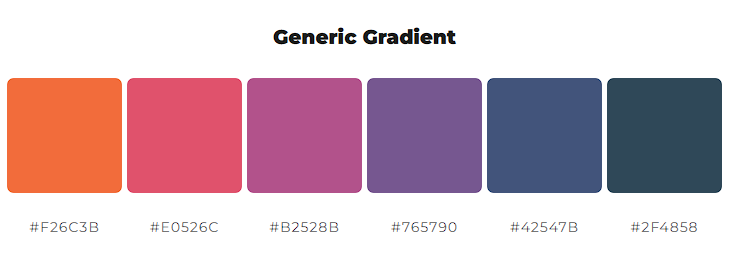

# Prosquadra

This project was generated with [Angular CLI](https://github.com/angular/angular-cli) version 18.2.10.

## Development server

Run `ng serve` for a dev server. Navigate to `http://localhost:4200/`. The application will automatically reload if you change any of the source files.

## Code scaffolding

Run `ng generate component component-name` to generate a new component. You can also use `ng generate directive|pipe|service|class|guard|interface|enum|module`.

## Build

Run `ng build` to build the project. The build artifacts will be stored in the `dist/` directory.

## Running unit tests

Run `ng test` to execute the unit tests via [Karma](https://karma-runner.github.io).

## Running end-to-end tests

Run `ng e2e` to execute the end-to-end tests via a platform of your choice. To use this command, you need to first add a package that implements end-to-end testing capabilities.

## Further help

To get more help on the Angular CLI use `ng help` or go check out the [Angular CLI Overview and Command Reference](https://angular.dev/tools/cli) page.

# Max's explanation corner
- Status Impl ToDo: Permission Setup

# Christian's explanation corner

### TODO:

- BL+Admin in keinem Team?
- Safe project Button führt 5 network requests + (Meldung) aus auch ohne Änderungen weil er alle roadmaps neu pulled -> unnötig. Entweder gar keine ohne changes oder nur die affected Roadmap neu pullen 
- Bei Projekterstellung sollte PO nur sein Team als Auswahl bekommen
- generell Berechtigungen überprüfen, wer darf wo was sehen bearbeiten usw.

COLOR SCHEME USED:



### BUGS

### SOLVED
- BUG: sm plant projekt ein und submitted. Datepicker verschwindet.+ fehlermeldung "Die Dauer darf nicht 0 Stunden und 0 Tage sein" aber erstes datumsetzen funktioniert und ab fresh wieder -> **i think this is solved**
- BUG: bei projekt erstellen. Wenn ich ein projekt erstelle und danach die reihenfolge anpasse und dann nochmal ein projekt erstelle resetted sich die reihenfolge. Im backend stimmt es also muss das frontend vermutlich neu pullen oder so. -> **i think this is solved**
- BUG: wenn ich einen Nutzer erstellen will und als rolle sm auswähle aber ihm nur ein Team(scheinbar egal) zuweise wird null and backend geschickt bei Team. Somit schlägt die erstellung fehl. -> **i think this is solved**
- BUG: wenn ich als sm neue Daten eintrage erscheint danach die erste Roadmap nochmal? Bei refresh stimmt es wieder. bzw. wenn ich nochmal welche eingeben will kommt der snackbar error ? -> **i think this is solved**
- Wenn ich das letzte Projekt in einer Roadmap lösche ist die Roadmap leer. Darf das sein? Wenn ja Fehlerabfragen! -> **i think this is solved**
- BUG: bei notifications, wenn ich schnell lösche ? kommt prisma error -> überprüfen (konnte nicht reproduzieren)
- BUG: Team-Roadmap: wenn ich ein Projekt lösche, wird die roadmap des zu löschenden Projektes dupliziert? Scheint edge case zu sein konnte nicht 100% reproduzieren **solved for now**


### perspektivisch

- current project in der rechten sidebar wird momentan gepolled also alle 30 sekunden gefetched. Funktioniert aber ist das gut? Reicht
- breakpoints sind momentan bei 1000px.
- backend route checking ist implementiert aber wird momentan nicht benutzt, da es 1. im frontend gemacht wird und 2. das FE momentan kein auth daten mitschickt bei requests
- calc(var()) durch neue variable ersetzen?
- PRIO: app-init-service aufsetzen und dort die fetches gestalten, bzw. aufjedenfall die fetches reduzieren. Überlegen ob es möglich ist, bei initalisierung einmal alle daten zu fetchen und dann only on update?
- roadmap scrolling horizontal erst ab overflow? damit vertikales scrollen nicht gefangen wird und man dadurch nicht horizontal scrollen kann
- Websockets??
- Teamübersicht visual bug bei kleinerem Screen (kann momentan vernachlässigt werden, da wir uns auf mobile oder desktop screensize fokussieren und nicht dazwischen)

## Routing

Das Dashboard ist so aufgebaut, dass die linke und rechte Seitenleiste (Sidebar) unverändert bleiben, während nur der mittlere Hauptinhalt bei der Navigation neu geladen wird.

### Routenstruktur

* ````/dashboard```` oder ````/dashboard/home````: Lädt die Standard-Ansicht des Dashboards (````DashboardHomeComponent````).
* ````/dashboard/create-project````: Lädt die Projekt-Erstellungsansicht (````CreateProjectComponent````).

Dieses Routing-Konzept sorgt für eine einfache Navigation innerhalb des Dashboards und ermöglicht ein schnelles Umschalten zwischen Ansichten, ohne die allgemeine Seitenstruktur zu beeinträchtigen :)

## Standalone Components

* Dieses Projekt nutzt Standalone Components, sodass jede Komponente ihre eigenen Abhängigkeiten verwaltet.
* RouterModule und andere Angular-Module (z. B. ````MatButtonModule````) müssen direkt in der ````imports````-Liste jeder Komponente angegeben werden, wenn sie benötigt werden.

## Preview


